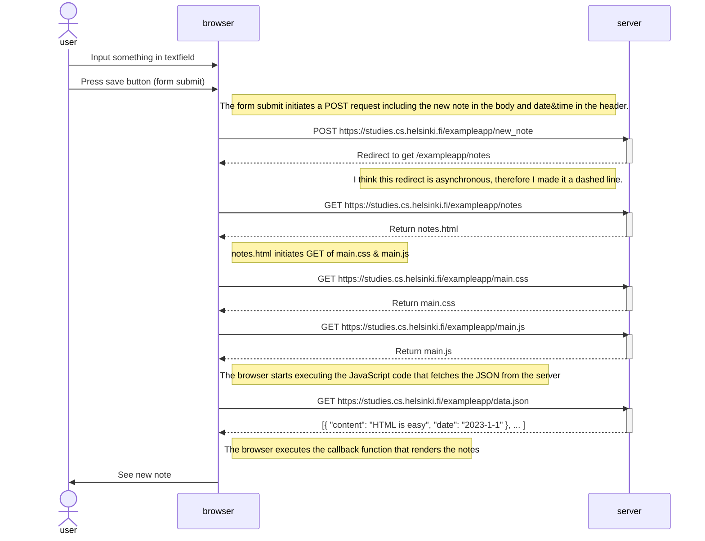

```mermaid

sequenceDiagram
    actor user
    participant browser
    participant server


    user->>browser: Input something in textfield

    user->>browser: Press save button (form submit)

    note right of browser: The form submit initiates a POST request including the new note in the body and date&time in the header.


    browser->>server: POST https://studies.cs.helsinki.fi/exampleapp/new_note
    activate server
    server-->>browser: Redirect to get /exampleapp/notes
    deactivate server

    note left of server: I think this redirect is asynchronous, therefore I made it a dashed line.

    browser->>server: GET https://studies.cs.helsinki.fi/exampleapp/notes
    activate server
    server-->>browser: Return notes.html
    deactivate server


    note right of browser: notes.html initiates GET of main.css & main.js

    browser->>server: GET https://studies.cs.helsinki.fi/exampleapp/main.css
    activate server
    server-->>browser: Return main.css
    deactivate server

    browser->>server: GET https://studies.cs.helsinki.fi/exampleapp/main.js
    activate server
    server-->>browser: Return main.js
    deactivate server

    Note right of browser: The browser starts executing the JavaScript code that fetches the JSON from the server

    browser->>server: GET https://studies.cs.helsinki.fi/exampleapp/data.json
    activate server
    server-->>browser: [{ "content": "HTML is easy", "date": "2023-1-1" }, ... ]
    deactivate server

    Note right of browser: The browser executes the callback function that renders the notes

    browser->>user: See new note
    

```

The functionality after the post request was copied from the website since it follows the same steps. 
