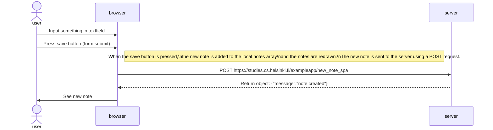

```mermaid

sequenceDiagram
    actor user
    participant browser
    participant server


    user->>browser: Input something in textfield

    user->>browser: Press save button (form submit)

    note right of browser: When the save button is pressed,\nthe new note is added to the local notes array\nand the notes are redrawn.\nThe new note is sent to the server using a POST request.


    browser->>server: POST https://studies.cs.helsinki.fi/exampleapp/new_note_spa
    activate server
    server-->>browser: Return object: {"message":"note created"}


    browser->>user: See new note
    
```