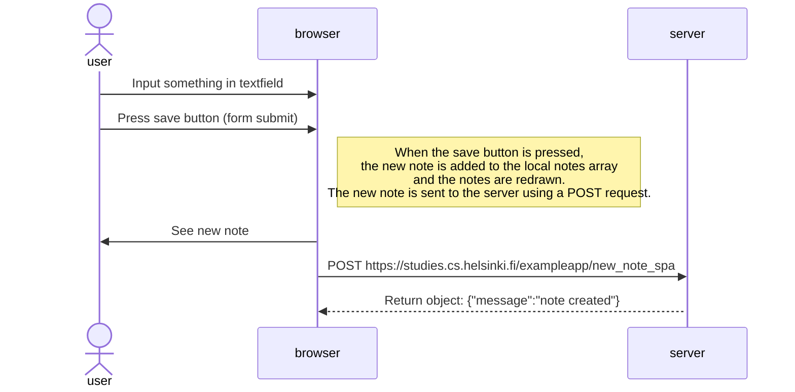

```mermaid

sequenceDiagram
    actor user
    participant browser
    participant server


    user->>browser: Input something in textfield

    user->>browser: Press save button (form submit)

    note right of browser: When the save button is pressed,<br>the new note is added to the local notes array<br>and the notes are redrawn.<br>The new note is sent to the server using a POST request.

    browser->>user: See new note    

    browser->>server: POST https://studies.cs.helsinki.fi/exampleapp/new_note_spa
    activate server
    server-->>browser: Return object: {"message":"note created"}
    
```